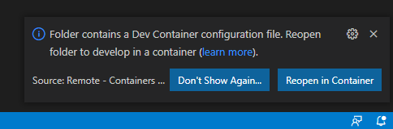
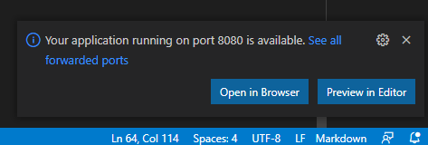

# What is the bluehands Academy even?
The bluehands Academy strives to be a knowledge base at and for bluehands.
The target audience is everyone including new beginners and advanced veterans.

# Requirements
## Tools
- Git
- Visual Studio Code
- Docker

## Setup
First clone the repository:
```bash
git clone <insert repo url here later>
```

Then open the newly cloned repository using Visual Studio Code. Also ensure that Docker Desktop is running if you're under Windows/macOS.

Visual Studio Code should prompt you to reopen the folder inside a container as there are devcontainer files available. Go ahead and do as asked.



# Creating an article
## A simple article
First create a new markdown file under `src/articles/` e.g. `src/articles/my_very_first_article.md`.

This new file now needs some data. The first part will be so called **frontmatter data** which is used for templating and other such things and the other is your **content**. Let's go ahead and add such data to our new article like this:
```markdown
---
title: My very first article
author: you
---
# This is my new article
And here is some content for it.
```

All the common markdown features should be available.

## A more advanced article
If you want to embed images or include other files and data then you should create a folder and put your article in there like this:
```bash
./src/articles/
├── ...
└── my_advanced_article
    ├── index.md
    └── very_important_screenshot.png
```

Now you can include images for example with:
```markdown

```

# Test it locally
Now you might have written a superb article but how to view it now? Don't worry. Everything's already prepared and ready for you to view your article. You can run it with:
```bash
npm run serve
```

Now the toolchain is started and in a matter of seconds the website is ready for viewing locally in your browser. Visual Studio Code will also remind you about this:


Now you are ready to write your first article. Have fun! ^^
